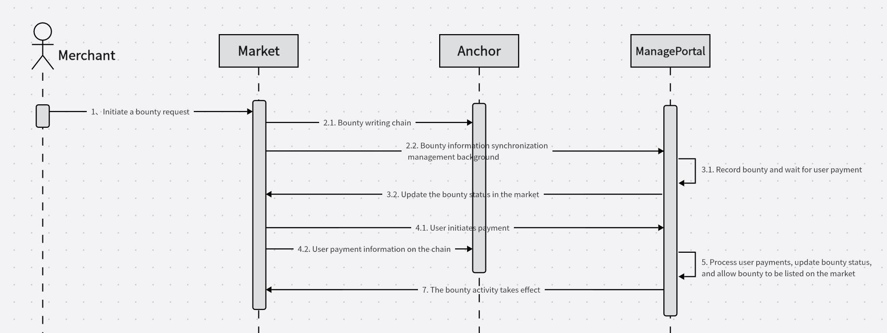
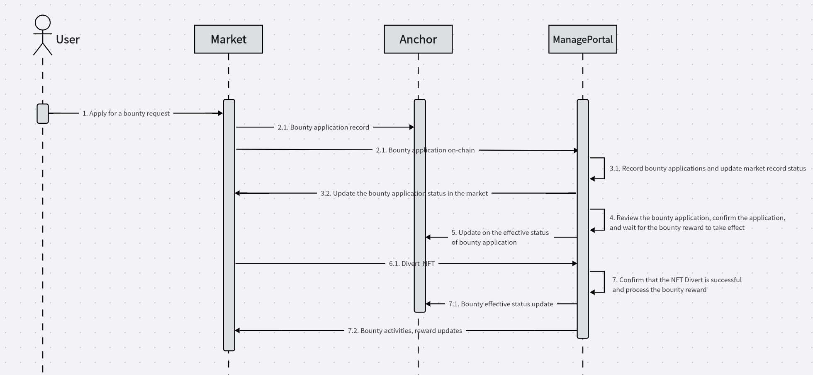

# iNFT, identifiable NFT

## Overview

- It is a new way to mint NFT by block hash and unmodified template file on chain such as IPFS.

- The design of template can make iNFT identifiable, the scarcity can be confirmed by template.

- As every blockchain network have random block hash, iNFT can be deployed to multi chain. It is pretty interesting that Dapp can balance value between different networks by mathematics scarcity.

- Try iNFT full functions, [iNFT Market](https://inft.w3os.net/market);

- Just minting, [iNFT Minter](https://inft.w3os.net/mint);

## System Structure

- Market system.

- Bounty merchant workflow.
    

- Bounty user workflow.
    

## Roadmap

### Multi Chain Operation

- Support multi chain airdrop by iNFT way, merchant can publish airdrop bounty on Anchor Network which is base on Substrate.

- All actions are recorded on Anchor Network where the iNFT is minted on.

### Multi Chain Asset

- Using the BTC block hash as the target for iNFT, and the iNFT on Anchor Network can be transfer to Etherum Network by `Last Words` method. When the iNFT on Anchor Network is dropped, the **Last Words** is written on chain, it can be used to approve the iNFT and create one on Etherum Network.

- Bridge ERC-20 token between Anchor Netwok and Etherum Network. By this way, Anchor Network can be restart frequently to keep it simple.

- The history data of Anchor Network with the Etherum salt can be store on IPFS, and the Merkel root on Etherum Network. Even the Anchor Network is crushed down, the asset can still be approved.

## Dapps

### Editor

- **Function**, It is the tools for designer to set the parameters for iNFT. Only the source image needed, the iNFT parts can be added here.

- **Language and Framework**,   React ( Javascript )

- **Github URL**, [https://github.com/ff13dfly/iNFT/tree/master/editor](https://github.com/ff13dfly/iNFT/tree/master/editor)

- Multi networks support, you can write the iNFT template on different blockchain network.

- Single iNFT file upload/download support.

### Minter

- **Function**, The client Dapp for normal users.

- **Language and Framework**,   React ( Javascript )

- **Github URL**, [https://github.com/ff13dfly/iNFT/tree/master/mint](https://github.com/ff13dfly/iNFT/tree/master/mint)

- Customer can explorer the templates, then mint on selected template.

- The list of result can be checked from minter.

- In some network, you can manage your account here.

### Market

- **Function**, Selling market of iNFT result. Customers can price the NFT themselves.

- **Language and Framework**,   React ( Javascript )

- **Github URL**, [https://github.com/ff13dfly/iNFT/tree/master/market](https://github.com/ff13dfly/iNFT/tree/master/market)

- Different networks supported.

### Bounty

- **Function**, Bounty for airdrop base on iNFT, merchant can publish bounty iNFT.

- **Language and Framework**,   React ( Javascript )

- **Github URL**, [https://github.com/ff13dfly/iNFT/tree/master/market](https://github.com/ff13dfly/iNFT/tree/master/market)

- Different networks supported. Full workflow on Anchor Network.

### Service

#### Faucet

- **Function**, User get airdrop from Anchor Network.

- **Language and Framework**,   Node.js ( Javascript )

- **Github URL**, [https://github.com/ff13dfly/iNFT/tree/master/service/airdrop](https://github.com/ff13dfly/iNFT/tree/master/service/airdrop)

- User get airdrop from Anchor Network.

#### API

- **Function**, get the bounty and cached iNFTs on server.

- **Language and Framework**,  PHP, Redis, MySQL

- **Github URL**, [https://github.com/ff13dfly/iNFT/tree/master/service/api](https://github.com/ff13dfly/iNFT/tree/master/service/api)

- Cooperating with `Cache Robot` to supply the iNFT data service.

#### Portal

- **Function**, managment portal for `market` and `bounty`.

- **Language and Framework**,  PHP, Redis, MySQL

- **Github URL**, [https://github.com/ff13dfly/iNFT/tree/master/service/portal](https://github.com/ff13dfly/iNFT/tree/master/service/portal)

- Bounty management. Put bounty on line or off line. Check the applying. Saving the bonus payment on Anchor Network.

#### Cache Robot

- **Function**, cache iNFT records and group them.

- **Language and Framework**,   Node.js ( Javascript )

- **Github URL**, [https://github.com/ff13dfly/iNFT/tree/master/service/history](https://github.com/ff13dfly/iNFT/tree/master/service/history)

- Group iNFTs by address.

- Group iNFTs by template.

- Record of iNFT history, including all actions (set, sell, buy, revoke, divert, drop)

- Subcribe Anchor Network to update the history of iNFT.

#### Minting Robot

- **Function**, mint iNFT by setting.

- **Language and Framework**,   Node.js ( Javascript )

- **Github URL**, [https://github.com/ff13dfly/iNFT/tree/master/service/robot](https://github.com/ff13dfly/iNFT/tree/master/service/robot)

- Multi accounts support to mint iNFT.

## Definition of iNFT

- The template of iNFT definition as follow. 

    ```Javascript
        //iNFT template
        {
            type:"2D",              //2D identifiable NFT.
            size:[
                "OUTPUT_SIZE_X",    //iNFT output size X
                "OUTPUT_SIZE_Y"     //iNFT output size Y
            ],
            cell:[
                "CELL_X",    //image grid size X
                "CELL_Y"     //image grid size Y
            ],
            puzzle:[        //pieces of iNFT. Will render by the array order, 0 is the background
                    {
                        value:[      //where to get the number of hash
                            "START",        //start position of hash string
                            "STEP",         //how many string to get from
                            "DIVIDE" ,      //how to divide, result%n, the value of "n"
                            "OFFSET",       //Random number offset to avoid same result
                            ],
                        img:[       //the position of image start, get by order, related ti "hash"
                            "LINE",         //line number of iNFT resource
                            "ROW",          //row number of iNFT resource
                            "LINE_EXT",     //default is 0,optional, line extend 
                            "ROW_EXT"       //default is 0,optional, row extend 
                            ],
                        position:[  //Position of this piece
                            "POSITION_X",   // The X position of this piece on iNFT
                            "POSITION_Y"    // The Y position of this piece on iNFT
                            ],
                        center:[    //this is optional, default is center of cell
                            "X",            //center X position        
                            "Y"             //center Y position     
                        ],
                        rotation:[  //this is optional 
                            "IMAGE_ROTATION",
                            "ROTATION_POSITION_X",
                            "ROTATION_POSITION_Y",
                        ],      
                        scale:1,    //this is optional        
                        fill:1,     //this is optional, wether fill the empty background     
                        color:[     //this is optional
                            "START",        //start position of hash string 
                            "STEP",         //default is 6,optional
                            "DIVIDE",       //optional, reduce the color amount. 
                            ["RED_OFFSET","GREEN_OFFSET","BLUE_OFFSET"]     //optional, adjust the color
                        ],
                        rarity:[            //How the part categoried to series. Parts can be multi used.
                            ["INDEX","INDEX", ... ],    //index parts, such as [0,2,3]
                            ["INDEX","INDEX", ... ],
                            ["INDEX","INDEX", ... ],
                        ]
                    },
                    ...         //iNFT is combined by pieces
                ]
            series:[        //description of rarity list
                {"name":"","desc":""},
                {"name":"","desc":""},
                {"name":"","desc":""},
                ...
            ]
            version:"VERSTION",     //iNFT template
            auth:["AUTH_NAME"]      //auth name list
        }
    ```

- iNFT mint data as follow. It is pretty simple to save gas fee.

    ```Javascript
        {
            "tpl":"ID_OF_TEMPLATE_FILE",        //ID of IPFS file
            "from":"ipfs",                      //source orgin
            "origin":"web3.storage",            //where to storage
            "offset":[0,3,0,3,6,5,3,9,7]        //optional, offset of mint following the template definition           
        }
    ```

## Multi Chain Asset

### Goal

- Create PoW iNFT asset.

- Even the `Anchor Network` crashed, the asset created on `Etherum Network` is also valid.

### Workflow

- Create a `Salt` on `Etherum Network`, it is related to `Bitcoin Network`.

- Using the `Salt` as parameter to mint iNFT on substate `Anchor Network`.

- `Bridge` package the mintings and save the merkel root hash on `Etherum Network`.

- When want to create the asset of iNFT on `Anchor Network`, write the iNFT data and supply the merkel path.

- Validor confirm the iNFT, the iNFT on `Anchor Network` will be dropped then.

### Howto

- `Substrate` chain such as Anchor Network is used to mint the iNFT.

- Bridge will package the mintings and save the merkel tree root on Etherum Network.

- When somebody want to bridge the iNFT on Anchor Network to other blockchain network, just drop the iNFT on Anchor Network and leave the last words about which account to accept the bridged iNFT. Then no need to write the bridge information when it is on Anchor Network.

- By `Last Words` way, the iNFT is simple on Anchor Network.

- Leaf data sample

    ```Javascript
        {
            "orgin":{       //data written on substrate chain
                "name":"ANCHOR_NAME",
                "raw":{
                    "target":{
                        "network":"btc",            //mint by Bitcoin Network hash
                        "block":6123456,            //target Bitcoin block height
                    },
                    "salt":"SALT_ON_ETHER",         //salt on Etherum Network
                    "offset":[],                    //mint offset
                    "tpl":"ID_OF_TEMPLATE_FILE",    //ID of IPFS file
                    "from":"ipfs",                  //source orgin
                    "origin":"web3.storage",        //where to storage
                }
                "protocol":{
                    "fmt":"data",
                    "type":"json",
                    "tpl":"inft",
                },
                "pre":0
            },
            "block":0,                                  //block number of Substrate Network where the iNFT data on
            "hash":"BLOCK_HASH_OF_ANCHOR_NETWORK",      //optional ,target block hash
            "signer":"SIGNER_ON_SUBSTRATE",
        }
    ```

## Resource
