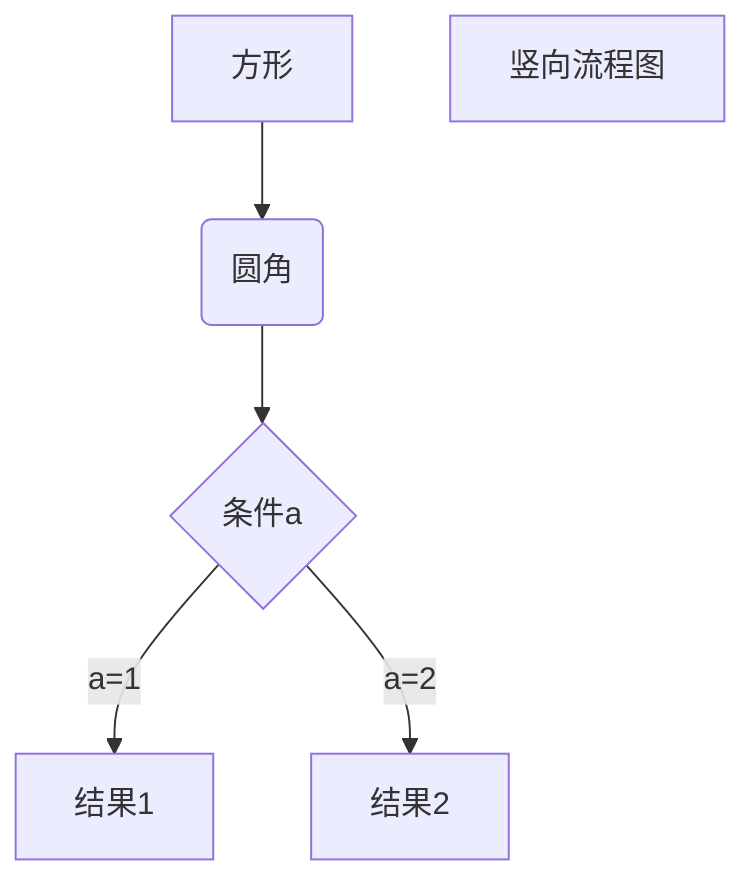

# Todo List Of iNFT

- Github: [https://github.com/ff13dfly/iNFT](https://github.com/ff13dfly/iNFT)

## White Paper

- Github folder: [https://github.com/ff13dfly/iNFT/tree/master/whitepaper](https://github.com/ff13dfly/iNFT/tree/master/whitepaper)

- [ ] Goal of iNFT.
- [ ] Definition of iNFT.
- [ ] How to on substrate network.
- [ ] How to on multi network.
- [ ] How to migrate iNFT as asset.

## Portal

- Client: PC.

- Language: Javascript ( React )

- Github folder: []()

- Demo: [https://inft.w3os.net](https://inft.w3os.net)

- Functions.

- [ ] Latest mint result.
- [ ] On selling iNFT list.
- [ ] Template list via API.

### Market

- Github folder: []()

- Demo: [https://inft.w3os.net/market](https://inft.w3os.net/market)

- Functions.

- [ ] Selling list.
- [ ] Selling list filter.
- [ ] iNFT selling detail.

### Bounty

- Github folder: []()

- Demo: [https://inft.w3os.net/market](https://inft.w3os.net/market)

- Functions.

- [x] New bounty submission.
- [x] Bounty list via API.
- [x] Bounty result apply.
- [ ] Bounty details review.

### Playground

- Github folder: []()

- Demo: [https://inft.w3os.net/market](https://inft.w3os.net/market)

- Functions

- [x] Load template from web3.storage
- [ ] Template hash mocker
- [ ] Template parts detail
- [ ] Template series detail
- [ ] Template raw data preview

### Support System

#### API

- Github folder: [https://github.com/ff13dfly/iNFT/tree/master/service/api](https://github.com/ff13dfly/iNFT/tree/master/service/api)

- Language: PHP

- Demo: [https://api.w3os.net](https://api.w3os.net)

- Functions

- [ ] iNFT category list by address.
- [ ] iNFT category list by template.
- [ ] iNFT category list by block.
- [ ] iNFT actions on chain.
- [ ] Bounty list.
- [ ] Bounty submission.

#### Manage Portal

- Github folder: [https://github.com/ff13dfly/iNFT/tree/master/service/portal](https://github.com/ff13dfly/iNFT/tree/master/service/portal)

- Language: PHP

- Demo: [https://api.w3os.net](https://api.w3os.net)

- Functions

- [ ] Bounty management.
- [ ] Template management.
- [ ] iNFT list management.
- [x] iNFT fav management.

#### Faucet Server

- Github folder: [https://github.com/ff13dfly/iNFT/tree/master/service/airdrop](https://github.com/ff13dfly/iNFT/tree/master/service/airdrop)

- Language: Javascript ( Node.js ) 

- Demo: [https://api.w3os.net](https://api.w3os.net)

- Functions

- [ ] Multi accounts auto swtich.
- [ ] Multi chain support.

#### Mint Robot

- Github folder: [https://github.com/ff13dfly/iNFT/tree/master/service/robot](https://github.com/ff13dfly/iNFT/tree/master/service/robot)

- Language: Javascript ( Node.js ) 

- Demo: [https://api.w3os.net](https://api.w3os.net)

- Functions

- [ ] Multi template support.
- [ ] Mint limitaion benchmark.

#### Cache Robot

- Github folder: [https://github.com/ff13dfly/iNFT/tree/master/service/history](https://github.com/ff13dfly/iNFT/tree/master/service/history)

- Language: Javascript ( Node.js ) 

- Demo: [https://api.w3os.net](https://api.w3os.net)

- Functions

- [ ] iNFT operation history data.
- [ ] iNFT list by account address.
- [ ] iNFT list by template.
- [ ] iNFT list by block.

#### IFPS Agent Server

- Github folder: [https://github.com/ff13dfly/iNFT/tree/master/service/template](https://github.com/ff13dfly/iNFT/tree/master/service/template)

- Language: Javascript ( Node.js ) 

- Demo: [https://api.w3os.net](https://api.w3os.net)

- Functions ( No update this time )

## Minter

- Client: PC / Mobile.

- Language: Javascript ( React )

- Github folder: [https://github.com/ff13dfly/iNFT/tree/master/mint](https://github.com/ff13dfly/iNFT/tree/master/mint)

- Demo: [https://inft.w3os.net/minter](https://inft.w3os.net/minter)

- [x] New UI of mint
- [x] Minting board
- [ ] Template preview
- [ ] iNFT management
- [ ] Multi chain support

## Editor

- Client: PC.

- Language: Javascript ( React )

- Github folder: [https://github.com/ff13dfly/iNFT/tree/master/editor](https://github.com/ff13dfly/iNFT/tree/master/editor)

- Demo: [https://inft.w3os.net/editor](https://inft.w3os.net/editor)

- [ ] Write template to IPFS via polkadot.js

## Pallet iNFT

- Substrate pallet.

- Language: Rust ( Substrate )

- Github folder: []()

- Demo: []()

- Functions.

- [ ] Register of template.
- [ ] Template remove.
- [ ] Mint from template.
- [ ] Anchor divert.
- [ ] Anchro drop.
- [ ] Update to latest version of Polkadot SDK ( Substrate ).

## Resource

- Markdown diagrams [https://docs.github.com/en/get-started/writing-on-github/working-with-advanced-formatting/creating-diagrams](https://docs.github.com/en/get-started/writing-on-github/working-with-advanced-formatting/creating-diagrams)

- Mermaid document [https://mermaid-js.github.io/mermaid/#/](https://mermaid-js.github.io/mermaid/#/)

## Sample Graph



```sequence
Title: 标题：复杂使用
对象A->对象B: 对象B你好吗?（请求）
Note right of 对象B: 对象B的描述
Note left of 对象A: 对象A的描述(提示)
对象B-->对象A: 我很好(响应)
对象B->小三: 你好吗
小三-->>对象A: 对象B找我了
对象A->对象B: 你真的好吗？
Note over 小三,对象B: 我们是朋友
participant C
Note right of C: 没人陪我玩
```