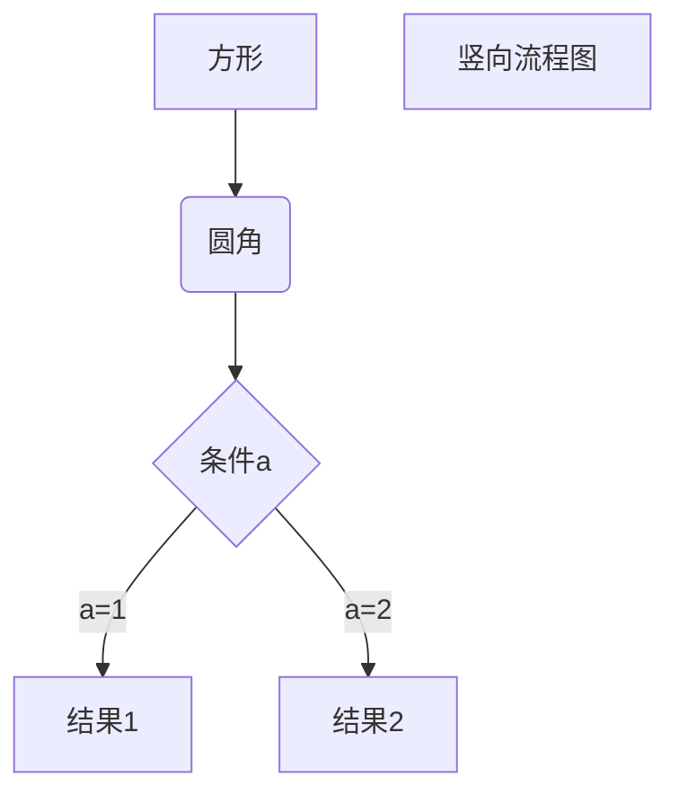

# Todo List Of iNFT

- Github: []()

## White Paper


## Portal

- Client: PC.

- Language: Javascript ( React )

- Github folder: []()

- Demo: [https://inft.w3os.net](https://inft.w3os.net)

### Market

- Github folder: []()

- Demo: [https://inft.w3os.net/market](https://inft.w3os.net/market)

- Functions.

### Bounty

- Github folder: []()

- Demo: [https://inft.w3os.net/market](https://inft.w3os.net/market)

- Functions.

### Playground

- Github folder: []()

- Demo: [https://inft.w3os.net/market](https://inft.w3os.net/market)

- Functions.
    [] Create new bounty.

### Support System

#### API

#### Manage Portal

#### Faucet Server

#### IFPS Agent Server

#### Mint Robot

#### Cache Robot

## Minter

- Client: PC / Mobile.

- Language: Javascript ( React )

- Github folder: []()

- Demo: [https://inft.w3os.net/minter](https://inft.w3os.net/minter)

## Editor

- Client: PC.

- Language: Javascript ( React )

- Github folder: []()

- Demo: [https://inft.w3os.net/editor](https://inft.w3os.net/editor)

## Pallet iNFT

- Substrate pallet.

- Language: Rust ( Substrate )

- Github folder: []()

- Demo: []()

- Functions.

## Sample Graph



```sequence
Title: 标题：复杂使用
对象A->对象B: 对象B你好吗?（请求）
Note right of 对象B: 对象B的描述
Note left of 对象A: 对象A的描述(提示)
对象B-->对象A: 我很好(响应)
对象B->小三: 你好吗
小三-->>对象A: 对象B找我了
对象A->对象B: 你真的好吗？
Note over 小三,对象B: 我们是朋友
participant C
Note right of C: 没人陪我玩
```